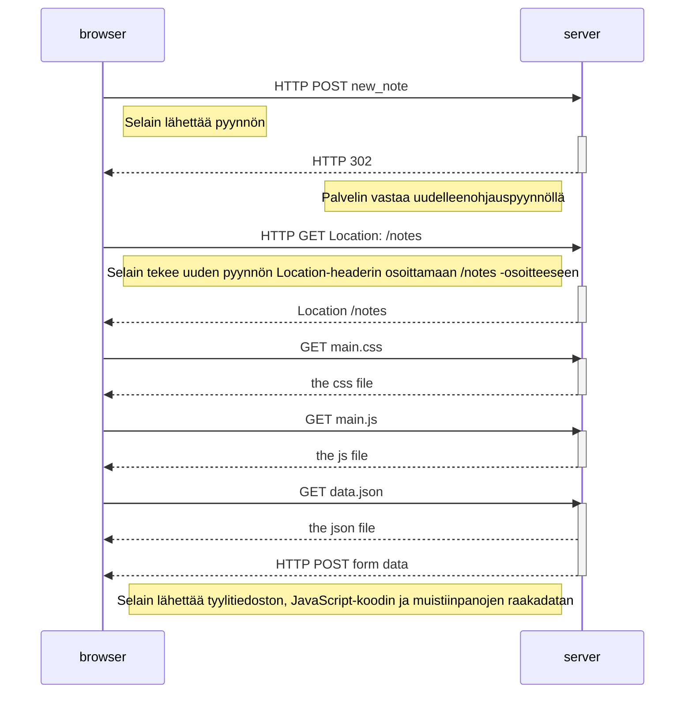

```mermaid
sequenceDiagram
	participant browser
	participant server
	
	browser->>server: HTTP POST new_note
	Note right of browser: Selain lähettää pyynnön

	activate server

	server-->>browser: HTTP 302
	deactivate server
	Note left of server: Palvelin vastaa uudelleenohjauspyynnöllä
	

	browser->>server: HTTP GET Location: /notes
	Note right of browser: Selain tekee uuden pyynnön Location-headerin osoittamaan /notes -osoitteeseen
	activate server
	server-->>browser: Location /notes
	deactivate server
	
	browser->>server: GET main.css
	activate server
	server-->>browser: the css file
	deactivate server
	browser->>server: GET main.js
	activate server
	server-->>browser: the js file
	deactivate server
	
	browser->>server: GET data.json
	activate server
	server-->>browser: the json file
	server-->>browser: HTTP POST form data
	deactivate server
	Note left of server: Selain lähettää tyylitiedoston, JavaScript-koodin ja muistiinpanojen raakadatan
```